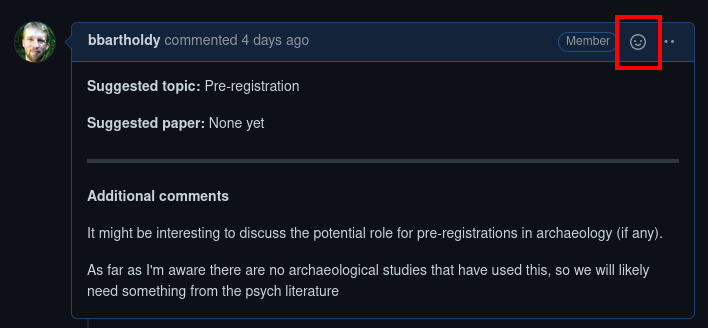

# 📚 Rchaeology Journal Club

Repository for the monthly Rchaeology journal club.

It contains the materials for each month, so you can clone the repository for easy access to the materials.

```bash
git clone git@github.com:rchaeology/jouRnal-club.git
cd jouRnal-club
```

Once cloned, you can 'pull' the new materials each month.

```bash
git pull
```

## Topics

To suggest a topic and an article to discuss at the journal club, submit an issue [here](https://github.com/rchaeology/jouRnal-club/issues/new?assignees=&labels=&template=suggest-a-topic.md&title=).

To vote for a topic, use the thumbs-up 👍 in the reactions:



### Previous topics

- Raincloud plots
- Bayesian stats in Archaeology
- R Markdown
- R Compendia [rrtools](https://github.com/benmarwick/rrtools)
- R packages
- Websites with [blogdown](https://bookdown.org/yihui/blogdown/)
